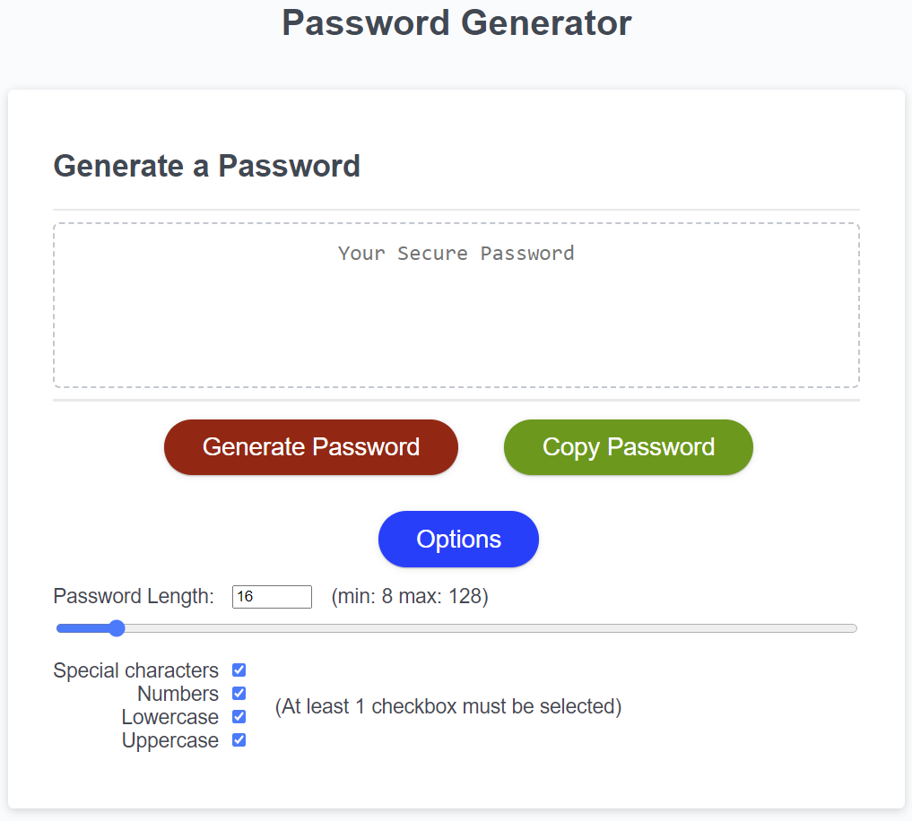

# Password-Generator

## Description

This project was created to implement a random password generator in JavaScript. The aims of this are practice my current knowledge in JavaScript and to ensure that the outputted password included:

* At least 1 lower-case letter.
* At least 1 upper-case letter.
* At least 1 numeric character.
* At least 1 special character.
* The password will need to have between 8 - 128 characters.
* The password generator will also need to give the user options to select the length of the password.

This tool allows users to create secure passwords which they can use to meet their organisations password requirements at a click of a button.

The main things I've learned from this project are:

* Practice with recursive functions by replacing loops.
* How to manipulate the DOM with JavaScript and to create buttons and inputs.

[Link to deployed web page.](https://saif-uddin-93.github.io/Password-Generator/)

## Table of Contents

- [Installation](#installation)
- [Usage](#usage)
- [Credits](#credits)
- [License](#license)

## Installation

For this project, the developer tool I'll be using is VS Code. A lightweight IDE that allows working in JavaScript. It also allows the use of Extensions which can add extra functionality to the tool to help with debugging and making code more readable. The main extension I'll be using is called, Live Server, by Ritwick Dey. The browser that the web page will be used on is Google Chrome and will work on all Chromium-based web browsers.

## Usage

By default clicking on the 'Generate Password' button outputs a 16 character password that includes all 4 character types. Clicking on the 'Options' button will reveal the options to change the length of the password and which types to include in the password. The 'Copy Password' doesn't copy the password on mobile devices but does function properly on a Windows version of Chrome. Below is a screenshot of the console output of the published webpage:

Below is how the initial prototype looked using prompts to enter user options:

| | |
|:-------------------------:|:-------------------------:|
| Entering password length via prompt |  Alert with password length |
| Example with invalid input |  Alert response for invalid input |

This was changed to using a slider due to getting critique mentioning that it would make the application more user-friendly. The original code for the prototype is still available in the JavaScript file for review but is commented out so not to affect the functionality of the current version.

## Credits

How to create an image grid for markdown was taken from the following example: https://gist.github.com/trusktr/93175b620d47827ffdedbf52433e3b37

Inputs and copy function were implemented by referencing examples found on [w3schools.com](https://www.w3schools.com/)

## License
### MIT License

Copyright (c) 2023 Saif-Uddin-93

Permission is hereby granted, free of charge, to any person obtaining a copy of this software and associated documentation files (the "Software"), to deal in the Software without restriction, including without limitation the rights to use, copy, modify, merge, publish, distribute, sublicense, and/or sell copies of the Software, and to permit persons to whom the Software is furnished to do so, subject to the following conditions:

The above copyright notice and this permission notice shall be included in all copies or substantial portions of the Software.

THE SOFTWARE IS PROVIDED "AS IS", WITHOUT WARRANTY OF ANY KIND, EXPRESS OR IMPLIED, INCLUDING BUT NOT LIMITED TO THE WARRANTIES OF MERCHANTABILITY, FITNESS FOR A PARTICULAR PURPOSE AND NONINFRINGEMENT. IN NO EVENT SHALL THE AUTHORS OR COPYRIGHT HOLDERS BE LIABLE FOR ANY CLAIM, DAMAGES OR OTHER LIABILITY, WHETHER IN AN ACTION OF CONTRACT, TORT OR OTHERWISE, ARISING FROM, OUT OF OR IN CONNECTION WITH THE SOFTWARE OR THE USE OR OTHER DEALINGS IN THE SOFTWARE.

## Badges

